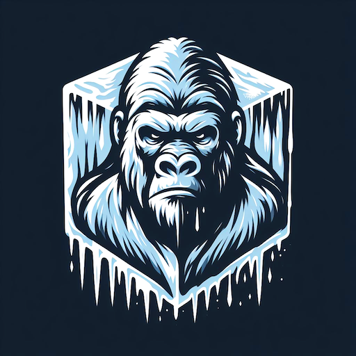

# Frozen A-Pose Exporter, a.k.a FrozenAPE 🧊🦍



FrozenAPE is a set of Unity-specific functions and Editor Menus
to allow moving a skinned model into a specific pose
and exporting the _frozen_ static mesh of that pose
into a Wavefront OBJ or FBX file.

This rather experimental package can be used to pose any given character model
into an A-Pose (hence this project's name), and export the frozen, static meshes as
OBJ files, to allow further modifications, such as re-skinning, in another DCC tool.

The whole picture is to simplify the workload for Technical Artists when faced to recycling models
to other games/engines that require skinning to a particular rig.
The closest use-case would be to transform a character model to A-Pose, freeze and export as OBJ,
and then reskin the model for e.g. Roblox.

## 🔧 Building and Running

Add the 2 registries as described below,
followed by the dependency on `com.kagekirin.frozenape`.

Then follow the project configuration described by [Cysharp's Csproj Modifier](https://github.com/Cysharp/CsprojModifier)
and add (copy) the `LangVersion.props` from this repo to the 'Addition Project Imports'.

### 🔨 Add the Project

Due to some dependencies, this projects requires adding the following registries to Unity:

* OpenUPM (which hosts a Unity dependency)
* Unity NuGet (which hosts a C# dependency)

#### Add OpenUPM registry

The following registry must be added to Unity's `manifest.json` `.scopedRegistries[]`:

```json
{
    "name": "OpenUPM",
    "url": "https://package.openupm.com",
    "scopes": [
        "com.cysharp",
        "com.kagekirin"
    ]
}
```

#### Add Unity NuGet registry

The following registry must be added to Unity's `manifest.json` `.scopedRegistries[]`:

```json
{
    "name": "Unity NuGet",
    "url": "https://unitynuget-registry.azurewebsites.net",
    "scopes": [
        "org.nuget"
    ]
}
```

#### Add package to project

Add `com.kagekirin.frozenape` to the `manifest.json` `.dependencies{}`:

```json
"dependencies": {
    "com.kagekirin.frozenape": "0.0.7",
}
```

## ⚡ Usage guide

### ▶ Running from Editor

FrozenAPE adds a few menu/context menu entries:

* _FrozenAPE > Export as Wavefront OBJ_: exports all the meshes from the currently selected GameObject
  or the currently selected Mesh as Wavefront|OBJ (aka Maya OBJ) file(s).
  CAVEAT: Since OBJ does not support skinning data per-se, the skinning data associated with
  `SkinnedMeshRenderer` will not be exported.
* _FrozenAPE > Create Sample Pose JSON_: creates a sample `pose.json` to allow manual modification.
* _FrozenAPE > Pose From JSON_: loads a JSON file and applies the pose data to the currently selected GameObject.
* _FrozenAPE > Freeze Current Pose_: creates a copy of the currently select GameObject,
  where every mesh has been replaced by a (baked) static mesh, frozen at the current pose.

Given a manually prepaired `pose.json`, the workflow to export the frozen pose would be:

1. _FrozenAPE > Pose From JSON_
2. _FrozenAPE > Freeze Current Pose_
3. _FrozenAPE > Export as Wavefront OBJ_

### ▶ Calling from code

The runtime consists of 4 interfaces and their respective implementations:

* `IWavefrontOBJWriter.WriteOBJ()` creates the OBJ mesh data (text) from a given mesh and its materials
* `IWavefrontMTLWriter.WriteMTL()` creates the OBJ material library (MTL file, text) from the materials associated with a mesh.
* `IRigPuppeteer.Pose()` moves the provided Transforms (from `GameObject.GetComponentsInChildren<Transform>(true)`) into the pose specified by a set of `PosedBones`.
* `IPoseFreezer.Freeze()` returns the _frozen_ (in Unity terms: _baked_) meshes and their respective materials from a `GameObject`, respectively a `SkinnedMeshRenderer`.

NOTE: registering the interfaces and their implementations with a dependency injection framework allows to inject the implementations at runtime.

## 🤝 Collaborate with My Project

Please refer to [COLLABORATION.md](./COLLABORATION.md)
